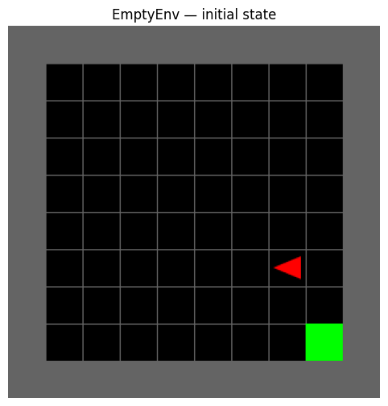
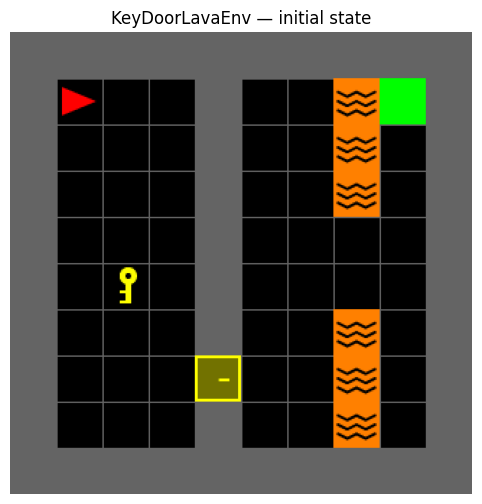

# 🧠 Tabular Reinforcement Learning in MiniGrid


**Authors:** Gilad Ticher (318770039) & Tal Hibner (026548446)  
**Course:** Reinforcement Learning — Mid-Semester Project, 2026 B

> Comparative study of **Monte Carlo**, **SARSA**, and **Q-Learning** on custom [MiniGrid](https://github.com/Farama-Foundation/Minigrid) environments, with reward shaping and Bayesian hyperparameter optimisation.

---

## Table of Contents

- [Overview](#overview)
- [Environments](#environments)
- [Algorithms](#algorithms)
- [State Representation](#state-representation)
- [Reward Shaping](#reward-shaping)
- [Results](#results)
- [Training Curves](#training-curves)
- [Hyperparameters](#hyperparameters)
- [Key Insights](#key-insights)
- [Repository Structure](#repository-structure)
- [Setup & Execution](#setup--execution)
- [Dependencies](#dependencies)

---

## Overview

This project implements and compares three classic **tabular RL** algorithms on two MiniGrid environments of increasing difficulty:

| Algorithm | Update Style | Core Mechanic |
|---|---|---|
| **Monte Carlo** | End-of-episode | Averages full episode returns; no bootstrapping |
| **SARSA** | Online · on-policy TD | Updates using the behaviour policy's actual next action |
| **Q-Learning** | Online · off-policy TD | Greedy-max bootstrap; decouples behaviour from evaluation |

**Bottom line:** TD methods (SARSA & Q-Learning) reach **100% success** on both environments. Monte Carlo plateaus at **~61%** on the complex environment — a structural consequence of full-return averaging over long, noisy trajectories.

---

## Environments

### EmptyEnv — Simple Navigation

| Property | Value |
|---|---|
| Grid size | 10×10 (8×8 walkable interior) |
| Agent start | Random cell, random direction |
| Goal | Fixed at bottom-right corner (8, 8) |
| Reward | Sparse: +1 at goal, 0 otherwise |
| Max steps | 256 |
| State space | 256 states |



---

### KeyDoorLavaEnv — Sequential Puzzle

The environment is split into two rooms by a partition wall. The agent must complete four sub-tasks in strict order:

```
┌─────────────────────────────────────┐
│  LEFT ROOM      │   RIGHT ROOM      │
│                 │                   │
│  ▶ Agent        │         🟢 Goal  │
│                 D (locked door)     │
│  🔑 Key         │   🔥🔥🔥🔥🔥  │
│                 │      ↕ safe gap  │
│                 │   🔥🔥🔥🔥🔥  │
└─────────────────────────────────────┘

Sub-task chain: 🔑 Find Key → 🚪 Open Door → 🌉 Cross Lava → 🏁 Goal
```

| Property | Value |
|---|---|
| Grid size | 10×10 (8×8 walkable interior) |
| Partition wall | Vertical at column 4 |
| Lava column | Column 7, safe gaps at rows 4–5 only |
| Agent start | Random cell in left room |
| Key | Random cell in left room |
| Door | Locked, random row on partition wall |
| Goal | Random corner in right room |
| Reward | Sparse +1 at goal + event-based shaping |
| Max steps | 512 |



---

## Algorithms

### Monte Carlo
- Updates Q-values **only at episode end** using the full discounted return $G_t = \sum_{k=0}^{T} \gamma^k R_{t+k+1}$
- Works well in short episodes (EmptyEnv), but struggles with long horizons
- **Critical flaw in KeyDoorLavaEnv:** Every failed episode averages a massive negative return (up to 512 step penalties) back through all visited states, violently corrupting Q-values

### SARSA (on-policy TD)
- Updates after **each step**: $Q(s,a) \leftarrow Q(s,a) + \alpha [r + \gamma Q(s',a') - Q(s,a)]$
- Uses the behaviour policy's next action $a'$ (ε-greedy), so Q-values near lava naturally reflect the risk of random missteps
- Immune to truncation noise — per-step updates never see the full trajectory penalty

### Q-Learning (off-policy TD)
- Updates after **each step**: $Q(s,a) \leftarrow Q(s,a) + \alpha [r + \gamma \max_{a'} Q(s',a') - Q(s,a)]$
- Decouples behaviour (ε-greedy) from evaluation (greedy max), enabling aggressive value propagation
- Fastest convergence of the three; produces the shortest greedy paths at inference

---

## State Representation

### EmptyEnv

```python
state = (agent_x, agent_y, agent_dir)
```

- **State space:** 8×8 grid × 4 directions = **256 states**
- **Q-table:** 256 × 3 actions = **768 entries**
- Actions used: `left`, `right`, `forward`

### KeyDoorLavaEnv — Phase-Conditioned State

A single flat tuple cannot handle four sub-tasks efficiently. We use a **phase-conditioned** state that encodes which sub-task is active and includes only the relevant target position:

| Phase | Trigger | State Tuple | Active Target |
|---|---|---|---|
| **0 — Find key** | Key not carried | `(ax, ay, 0, kx, ky, dir)` | Key position |
| **1 — Open door** | Key carried, door closed | `(ax, ay, 1, dx, dy, dir)` | Door position |
| **2 — Reach goal** | Door open | `(ax, ay, 2, gy, dir)` | Goal row |

| Phase | Agent Domain | Target Domain | Directions | States |
|---|---|---|---|---|
| 0 — Key Search | Left room (24 cells) | Key (24 positions) | 4 | 2,304 |
| 1 — Door Open | Left room (24 cells) | Door (8 rows) | 4 | 768 |
| 2 — Cross Lava | Both rooms (~56 cells) | Goal (2 corners) | 4 | 448 |
| **Total** | | | | **~3,520** |

- **Q-table:** 3,520 × 5 actions = **~17,600 entries**
- Actions used: `left`, `right`, `forward`, `pickup`, `toggle`

> **Why phase-conditioned?** Without the phase index, two states at the same (x, y, dir) but different key positions would share a Q-table entry — causing Q-value conflicts that prevent convergence. Phase conditioning makes the MDP fully Markovian.

---

## Reward Shaping

Pure sparse reward (+1 at goal only) makes KeyDoorLavaEnv nearly unsolvable by random exploration — the probability of completing all four sub-tasks in order by chance is negligible.

We apply **one-shot event-based shaping**: a large bonus fires exactly once per sub-task milestone, then is locked out for the rest of the episode:

| Event | Bonus | Guard flag |
|---|---|---|
| Pick up the key | **+3.0** | `_got_key_bonus` — resets only at episode start |
| Cross the lava gap | **+2.4** | `_got_cross_bonus` — resets only at episode start |
| Per-step penalty | **−0.0005** | Applied every step |

**Ratio check:** `key_bonus (3.0) >> max step penalty (0.0005 × 512 = 0.256)` ✓

This creates a **curriculum effect**: the agent first masters key retrieval, then door opening, then lava crossing — each stage's reward signal is unambiguous and cannot be farmed.

**Bonus magnitudes were found via Optuna** (TPE sampler, 25 trials × 20,000 episodes each). Trials with bonuses ≤ 0.5 consistently failed; the jump to ≥ 2.0 unlocked convergence.

---

## Results

### EmptyEnv — Greedy Evaluation (100 episodes)

| Algorithm | Avg Reward | Avg Steps | Success Rate |
|---|---|---|---|
| Monte Carlo | 1.000 | 16.0 | ✅ **100.0%** |
| SARSA | 1.000 | 9.4 | ✅ **100.0%** |
| Q-Learning | 1.000 | 9.4 | ✅ **100.0%** |

*All three algorithms solve EmptyEnv perfectly. SARSA and Q-Learning find 40% shorter paths than MC due to their per-step updates propagating values along the optimal trajectory more efficiently.*

### KeyDoorLavaEnv — Greedy Evaluation (100 episodes)

| Algorithm | Avg Reward | Avg Steps | Success Rate |
|---|---|---|---|
| Monte Carlo | 4.960 | 227.4 | ⚠️ 61.0% |
| SARSA | 6.388 | 24.7 | ✅ **100.0%** |
| Q-Learning | 6.387 | 25.2 | ✅ **100.0%** |

*Monte Carlo's ceiling is a structural limitation, not a tuning failure — MC is fundamentally crippled by high-variance episode returns on long-horizon tasks with sparse rewards.*

---

## Training Curves

### EmptyEnv

All three algorithms converge within the first ~300 episodes, after which performance plateaus. TD methods (SARSA, Q-Learning) find shorter paths than Monte Carlo.


### KeyDoorLavaEnv

SARSA and Q-Learning converge sharply and stably around episode 10,000–20,000. Monte Carlo exhibits persistent high variance throughout all 200,000 episodes — a hallmark of the full-return averaging problem.


### Optuna Hyperparameter Optimisation

25 TPE trials searching the joint hyperparameter space. The optimisation history (left) shows a sharp phase transition: trials 0–6 score 0%, trial 7 cracks the task. The correlation plot (right) identifies `key_bonus` and `eps_min` as the most impactful parameters.


---

## Hyperparameters

### EmptyEnv (all algorithms share settings)

| Parameter | Value | Rationale |
|---|---|---|
| α (learning rate) | 0.1 | Small table converges quickly; avoids oscillation |
| γ (discount) | 0.99 | Keeps goal reward visible from random start |
| ε start → decay → min | 0.5 → 0.995 → 0.05 | Reaches ε_min ~episode 600; ~1,100 episodes of exploitation |
| Q-init | 0.5 (optimistic) | Drives systematic state coverage early in training |
| Episodes | 1,700 | Ensures full state space coverage before ε decays |

### KeyDoorLavaEnv (per-algorithm — no single config works for all three)

| Parameter | Monte Carlo | SARSA | Q-Learning | Why different |
|---|---|---|---|---|
| α | 0.05 | 0.05 | **0.1** | Q-Learning can afford higher α; MC/SARSA need low α to average out noise |
| γ | **0.99** | 0.96 | 0.96 | MC needs high γ so goal reward at step 50 isn't discounted to ~0; TD's large bonuses risk over-optimism at γ=0.99 |
| ε decay | **0.9999** | 0.995 | 0.995 | MC's tiny α forces a very slow decay; TD learns fast and can commit to exploitation early |
| ε min | 0.05 | **0.01** | 0.05 | SARSA safely locks in a stable policy at 0.01; MC needs 5% noise floor to escape local minima |
| Q-init | **0.5** | 0.05 | 0.05 | MC uses Q-values for action selection throughout (no per-step updates), so optimistic init is crucial |
| Episodes | **200,000** | 50,000 | 50,000 | MC's slow decay (0.9999) requires 4× more episodes to average out noise |

---

## Key Insights

### 1. Why Monte Carlo Fails on Long Horizons
When an episode is truncated at 512 steps without reaching the goal, the full trajectory return contains 512 step penalties averaged across every state visited. A single bad episode can violently drag down Q-values for states that are actually on the optimal path — this is the **high-variance truncation trap**. TD methods sidestep this entirely by updating per-step and ignoring future outcomes.

### 2. The ε-Decay Trap
MC is forced to use a very slow epsilon decay (0.9999) because its learning rate is tiny (α=0.05). With fast decay, MC would commit to exploitation before its Q-table is meaningfully built. TD methods can use fast decay (0.995) because they discover good actions within a few hundred episodes. This forces MC to train for 200k episodes vs. 50k for TD — a 4× compute penalty just to average out the injected noise.

### 3. Why γ Must Differ Across Algorithms
With large shaping bonuses (+3.0, +2.4) and γ=0.99, Q-Learning's greedy-max bootstrap propagates these values aggressively forward — creating over-optimistic Q-values near the lava. Reducing γ to 0.96 dampens this propagation. MC, on the other hand, computes the full discounted return: a goal reached at step 50 is worth `0.99^50 ≈ 0.61` at γ=0.99 vs. `0.96^50 ≈ 0.13` at γ=0.96 — nearly invisible noise with γ=0.96, so MC requires the higher discount.

### 4. Reward Shaping as a Curriculum
The one-shot bonus design is critical: a bonus that could be farmed repeatedly would teach the wrong behaviour. By firing only once per episode, each milestone becomes a genuine sub-goal that the agent must sequence correctly — effectively automating curriculum learning without a handcrafted curriculum.

### 5. Phase-Conditioned States Enable Tractable Tables
A flat state including all entity positions simultaneously would require >100k entries and force the agent to learn irrelevant correlations (e.g., door position is irrelevant once the door is open). Phase conditioning reduces the effective table to ~17,600 entries while guaranteeing Markov completeness.

---

## Repository Structure

```
reinforcement-learning-tabular-Assignment2/
│
├── HW2_2026B_KeyDoorLava_finalfinalfinal.ipynb   # ← Main notebook
│     Environments · Agents · Training · Evaluation · Videos · Optuna
│
├── report_026548446_318770039.pdf                 # Final compiled report
├── report_026548446_318770039.md                  # Report source (Markdown)
├── Assignment 2 - Tabular RL in MiniGrid env.pdf  # Assignment specification
├── pyproject.toml                                 # Dependencies & project config
│
├── img_empty_initial.png                          # EmptyEnv screenshot
├── img_empty_train.png                            # EmptyEnv training curves
├── img_keydoor_initial.png                        # KeyDoorLavaEnv screenshot
├── img_keydoor_train.png                          # KeyDoorLavaEnv training curves
├── img_optuna.png                                 # Optuna optimisation results
│
├── checkpoints/                                   # Saved Q-tables (.npz)
│   ├── MonteCarlo_KeyDoorLavaEnv_1000.ckpt.npz
│   ├── MonteCarlo_KeyDoorLavaEnv_5000.ckpt.npz
│   ├── SARSA_KeyDoorLavaEnv_1000.ckpt.npz
│   ├── SARSA_KeyDoorLavaEnv_5000.ckpt.npz
│   ├── QLearning_KeyDoorLavaEnv_1000.ckpt.npz
│   └── QLearning_KeyDoorLavaEnv_5000.ckpt.npz
│
├── videos/                                        # Recorded agent policies (MP4)
│   ├── EmptyEnv_random.mp4           # Random baseline
│   ├── EmptyEnv_QL_mid.mp4           # Mid-training Q-Learning
│   ├── EmptyEnv_QL_converged.mp4     # Converged Q-Learning
│   ├── KeyDoorLavaEnv_random.mp4     # Random baseline
│   ├── KeyDoorLavaEnv_QL_best.mp4    # Best Q-Learning policy
│   ├── KDL_QL_mid.mp4                # Mid-training Q-Learning
│   └── KDL_QL_converged.mp4          # Converged Q-Learning
│
└── drafts/                                        # Development notebooks & scripts
```

---

## Setup & Execution

### Prerequisites

- Python ≥ 3.12

### Installation

**Option A — pip:**
```bash
git clone https://github.com/<your-username>/reinforcement-learning-tabular-Assignment2.git
cd reinforcement-learning-tabular-Assignment2
pip install minigrid gymnasium numpy matplotlib tqdm optuna imageio imageio-ffmpeg ipython
```

**Option B — uv (recommended):**
```bash
git clone https://github.com/<your-username>/reinforcement-learning-tabular-Assignment2.git
cd reinforcement-learning-tabular-Assignment2
uv sync
```

### Running the Notebook

```bash
jupyter notebook HW2_2026B_KeyDoorLava_finalfinalfinal.ipynb
```

The notebook is fully self-contained and designed to run top-to-bottom:

| Section | Contents |
|---|---|
| **1. Environments** | `EmptyEnv` and `KeyDoorLavaEnv` class definitions |
| **2. Agents** | Monte Carlo, SARSA, Q-Learning implementations |
| **3. Training** | Training loops with configurable hyperparameters |
| **4. Evaluation** | Greedy rollouts, success rate, avg steps |
| **5. Visualisation** | Learning curves, environment renders, video export |
| **6. Optuna** | Bayesian hyperparameter search (optional, slow) |

---

## Dependencies

| Package | Version | Purpose |
|---|---|---|
| `gymnasium` | ≥ 1.3.0 | Standard RL environment API |
| `minigrid` | ≥ 3.1.0 | Grid-world environment suite |
| `numpy` | ≥ 2.4.6 | Q-table storage & numerical operations |
| `matplotlib` | ≥ 3.10.9 | Training curve & environment plots |
| `tqdm` | ≥ 4.67.3 | Progress bars during training |
| `optuna` | ≥ 4.9.0 | Bayesian hyperparameter optimisation (TPE) |
| `imageio` | ≥ 2.37.3 | Video frame capture |
| `imageio-ffmpeg` | ≥ 0.6.0 | MP4 encoding backend |
| `ipython` | ≥ 9.14.0 | Notebook display utilities |
