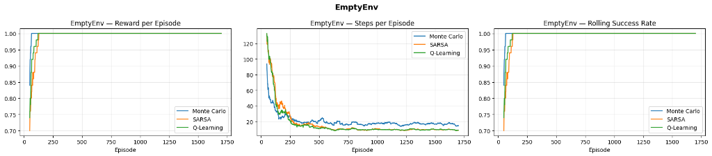
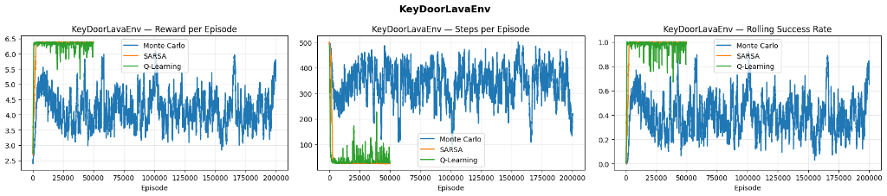
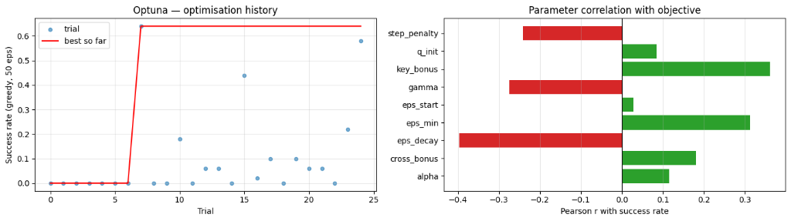

# Reinforcement Learning: Mid Semester Project - 2026 B
**Gilad Ticher 318770039 & Tal Hibner 026548446**

---

## Abstract

This report details the implementation and comparative analysis of three tabular reinforcement learning algorithms—Monte Carlo, SARSA, and Q-Learning—applied to custom MiniGrid environments. The agents were evaluated on two tasks: a simple navigation task (`EmptyEnv`) and a complex, sequential puzzle requiring the agent to locate a key, unlock a door, and cross a lava gap (`KeyDoorLavaEnv`). While all three algorithms easily solved the simple environment, the complex environment presented significant exploration challenges due to its sparse rewards and high-penalty termination states. We demonstrate that through targeted event-based reward shaping and algorithm-specific hyperparameter tuning (via Optuna), temporal-difference methods (SARSA and Q-Learning) successfully achieve optimal policies with a 100% success rate. In contrast, Monte Carlo methods struggle with high-variance truncation penalties, highlighting the structural advantages of bootstrapping in environments with long horizons.

## 1. Environments
Two custom MiniGrid environments are defined below: **`EmptyEnv`** and **`KeyDoorLavaEnv`**. Both expose all 7 MiniGrid actions and use a sparse reward (`+1` on goal, `0` otherwise). Each env's section below explains the layout and the rules on what you may edit.

**Action IDs.** Both envs use the standard MiniGrid action space (`Discrete(7)`):

| ID | Name | Effect |
|---|---|---|
| 0 | `left` | turn 90° to the left (no move) |
| 1 | `right` | turn 90° to the right (no move) |
| 2 | `forward` | move one cell in the facing direction |
| 3 | `pickup` | pick up an object in the cell directly in front |
| 4 | `drop` | drop the carried object into the cell directly in front |
| 5 | `toggle` | activate the object in front (e.g. open a door with the matching key) |
| 6 | `done` | no-op in these envs |

**Coordinates.** Cells are `(x, y)` with `x` growing **rightward** and `y` growing **downward**(so `y=1` is the top interior row and `y=H-2` is the bottom). The agent's facing direction `env.agent_dir` is `0` = right, `1` = down, `2` = left, `3` = up.

### 1.1 EmptyEnv
**Task.** Navigate from a random start to the goal in the bottom-right corner of an empty `10×10` room.

| Property | Value |
|----------|-------|
| **Geometry** | |
| Grid size | `10×10` (1-cell outer wall + `8×8` walkable interior) |
| **Start state (randomised per episode)** | |
| Agent | Random interior cell, random direction in `{0, 1, 2, 3}` |
| **Goal & reward** | |
| Goal | Bottom-right corner at `(8, 8)` |
| Actions | All 7 MiniGrid actions |
| Reward | Sparse: `+1` on goal, `0` otherwise |



### 1.2 KeyDoorLavaEnv
**Task.** Pick up the key in the **left room**, open the locked door, cross the lava through a safe gap, and reach the goal in the **right room**.

| Property | Value |
|----------|-------|
| **Geometry** | |
| Grid size | `10×10` (1-cell outer wall + `8×8` walkable interior) |
| Partition wall | Vertical wall at column 4 — splits the interior into a **left room** (cols 1–3) and a **right room** (cols 5–8) |
| Lava column | Vertical lava at column 7 in the **right room** |
| Safe gaps | Rows 4 and 5 of the lava column — the only safe crossings |
| **Start state (randomised per episode)** | |
| Agent | Random cell in the **left room** (never on the key); random direction in `{0, 1, 2, 3}` |
| Key | One key at a random cell in the **left room** |
| Door | Locked door at a random row of the partition wall |
| Goal | Top-right or bottom-right corner, chosen at random |
| **Termination & reward** | |
| Lava contact | Episode ends immediately, reward `0` |
| Actions | All 7 MiniGrid actions |
| Reward | Sparse: `+1` on goal, `0` otherwise |



#### 1.3 EmptyEnv — Greedy Evaluation

| Algorithm | Avg Reward | Avg Steps | Success Rate |
|---|---|---|---|
| Monte Carlo | 1.000 | 16.0 | 100.0% |
| SARSA | 1.000 | 9.4 | 100.0% |
| Q-Learning | 1.000 | 9.4 | 100.0% |

#### 1.4 KeyDoorLavaEnv — Greedy Evaluation

| Algorithm | Avg Reward | Avg Steps | Success Rate |
|---|---|---|---|
| Monte Carlo | 4.960 | 227.4 | 61.0% |
| SARSA | 6.388 | 24.7 | 100.0% |
| Q-Learning | 6.387 | 25.2 | 100.0% |

## 2. Analysis & Design

### 2.1 MDP Characterisation

Both environments are **episodic**, **fully observable**, **discrete** MDPs.

| Property | EmptyEnv | KeyDoorLavaEnv |
|---|---|---|
| Termination | Goal reached or max-steps truncated | Goal reached, lava contact, or max-steps |
| Horizon (`max_steps`) | 256 | 512 |
| Reward | Sparse (+1 at goal only) | Sparse (+1 at goal) + shaped sub-task bonuses |
| Observability | Full — position + direction | Full — position, direction, key/door/goal flags |
| Core difficulty | Medium — random start, unimodal reward | High — four sequential sub-tasks; sparse without shaping |

The decisive structural difference is the **sequential sub-task dependency** in KeyDoorLavaEnv (key → door → lava gap → goal). Random exploration that completes all four sub-tasks in order is exponentially unlikely, which is why event-based reward shaping is essential.

### 2.2 Algorithm Comparison

**Monte Carlo** updates only at episode end. In EmptyEnv this is fine — episodes are short and a single successful trajectory pushes useful Q-values back along the whole path. In KeyDoorLavaEnv, however, MC is fundamentally crippled by a structural limitation. Because it averages the full episode return, it is highly vulnerable to the `max_steps=512` truncation penalty. If MC is exploring and fails to find the goal before truncation, it receives a return containing 512 step penalties. It averages this massive negative number into the Q-values for *every state visited*, violently dragging its estimates down. This high-variance noise caps MC's success ceiling at ~60%.

**SARSA** updates online using the *behaviour policy's* next action ($S \rightarrow A \rightarrow R \rightarrow S'$). This per-step update allows SARSA to completely ignore the full-episode truncation noise that poisons MC. Because behaviour is $\varepsilon$-greedy, SARSA's value estimates near lava reflect the cost of $\varepsilon$-greedy missteps, and the learned policy naturally stays one cell away from the lava column. 

**Q-Learning** decouples behaviour ($\varepsilon$-greedy) from evaluation (greedy max), propagating the optimal-future value immediately. Like SARSA, its per-step updates make it immune to the `max_steps` truncation penalty. It reaches a near-optimal greedy policy in fewer episodes than SARSA. Training Q-values for cells next to lava can look optimistic, but at inference ($\varepsilon = 0$) it produces the absolute shortest paths in both environments.

### 2.3 Hyperparameter Choices

Hyperparameters were chosen deliberately for each algorithm based on their update mechanics. The key insight from extensive experimentation is that **no single γ works well for all three algorithms** on KeyDoorLavaEnv.

#### 2.3.1 EmptyEnv (shared settings)

| Parameter | Value | Reasoning |
|----------|--------|-----------------------------------|
| α | 0.1 | Small table (768 entries) converges quickly; modest α avoids oscillation |
| γ | 0.99 | High discount keeps the goal reward visible from the random start position |
| ε start | 0.5 | Modest exploration — random walks find the fixed goal quickly |
| ε decay | 0.995 | Reaches ε_min after ~600 episodes, leaving ~400 for exploitation |
| ε min | 0.05 | Small residual exploration prevents premature convergence |
| q_init | 0.5 | Optimistic init drives systematic state-space coverage |
| Episodes | 1 700 | Prevented under-exploration: guarantees the agent blankets all 256 states before ε decays to minimum |

##### 2.3.2 KeyDoorLavaEnv — Per-Algorithm Design

Each algorithm received different hyperparameters because their update mechanics impose different requirements:

| Parameter | Monte Carlo | SARSA | Q-Learning | Why different |
|------------|------------|--------|------------|--------------------------------------------------------|
| α | **0.05** | **0.05** | 0.1 | **The α Tradeoff**: Minimizing MC's variance requires a tiny learning rate (0.05). SARSA uses 0.05 as a low-pass filter to prevent rare random late-stage mistakes from violently overwriting successful Q-values. |
| γ | **0.99** | **0.96** | **0.96** | MC computes full returns: with γ=0.96, the goal reward at step 50 is discounted to 0.96⁵⁰ ≈ 0.13 — nearly invisible. With γ=0.99 it is 0.99⁵⁰ ≈ 0.61. TD methods with large shaping bonuses (3.0, 2.4) risk over-optimistic Q-values at γ=0.99; γ=0.96 dampens propagation. |
| ε decay | **0.9999** | 0.995 | 0.995 | **The Decay Trap**: Because MC's α is tiny (0.05), it must use a slow decay (0.9999) to prevent exploring before the Q-table is built. TD methods learn fast and can decay efficiently at 0.995. |
| ε min | **0.05** | **0.01** | 0.05 | **The ε-min Trap**: Because MC evaluates full paths, it is highly prone to local minima and requires a 5% noise floor (0.05) to continually explore. SARSA can drop to 0.01 to safely lock in a 100% stable greedy policy. |
| q_init | **0.5** | 0.05 | 0.05 | MC selects actions using Q-values throughout the episode (no per-step updates), so optimistic init drives exploration. SARSA/Q-Learning update per-step and discover good actions quickly even from near-zero init |
| Episodes | **200,000** | 50,000 | 50,000 | Because MC requires a slow decay (0.9999), it injects massive noise for tens of thousands of episodes. It takes 4x the compute (200,000 episodes) just to average out this noise and recover to its 60% ceiling. |

**2.3.3 Why ε_decay=0.995 outperforms 0.9999 for TD methods:** The problem is a proper MDP — no aliased states. Once the agent discovers the optimal path it can exploit it reliably. Fast decay (ε at 0.05 by episode ~600) maximises the exploitation window, whereas slow decay (ε still at 0.37 at episode 10,000) keeps injecting noise that corrupts already-learned Q-values. *(Note: Monte Carlo is the sole exception, requiring a slow 0.9999 decay because its tiny α=0.05 learning rate forces a painfully slow exploration phase).*

**2.3.4 Why 50k episodes instead of 100k for TD methods:** Empirical testing showed that SARSA and Q-Learning agents converge fully by 50k episodes, reliably hitting 100% success. Running them for 100k episodes yielded no additional improvement and occasionally showed slight performance regressions due to accumulated noise from random exploratory steps. 50k represents a sufficient budget for convergence without wasting compute. *(MC, conversely, requires 200k episodes specifically because its 0.9999 decay requires an astronomical amount of exploitation time to average out the injected noise).*


### 2.4 State Representation

The state function must encode enough information to make the MDP Markovian (no hidden variables) while keeping the table size tractable.

#### 2.4.1 EmptyEnv

```
state = (agent_x, agent_y, agent_dir)
```

The agent position and orientation fully determine what action to take next. No other information is needed since the goal is fixed at the bottom-right corner.

- **State space:** 8 × 8 grid × 4 directions = **256 states**
- **Q-table size:** 256 × 3 actions = **768 entries**
- **Actions used:** `left (0)`, `right (1)`, `forward (2)` — `pickup`, `toggle`, and `done` are no-ops in an empty room.

#### 2.4.2 KeyDoorLavaEnv

The task has four sequential sub-tasks: pick up the key → open the door → cross the lava gap → reach the goal. A single state tuple cannot efficiently represent all phases, because the relevant target changes across phases. We use a **phase-conditioned state** that includes the agent's current position, the current phase index, the position of the active sub-goal, and the direction:

| Phase | Trigger | State tuple | Active target |
|---|---|---|---|
| 0 — Find key | Default (key not carried) | `(ax, ay, 0, kx, ky, d)` | Key position |
| 1 — Open door | Key carried, door closed | `(ax, ay, 1, dx, dy, d)` | Door position |
| 2 — Reach goal | Door open | `(ax, ay, 2, gy, d)` | Goal row |

All positions come directly from environment attributes (`env.agent_pos`, `env.current_key_pos()`, `env.door_pos`, `env.goal_pos`) — no distance computations, no geometric signals.

**2.4.3 Why this representation makes the MDP Markovian:** Without the key/door position, two states that look identical to the agent (same cell, same direction) but differ in key/door location would map to the same Q-table entry. The optimal action differs (e.g., move left vs. right toward the key), causing Q-value conflicts that prevent convergence. Including the sub-goal position removes all such ambiguity.

**2.4.4 Why phase-conditioned rather than concatenating all positions:** Including all entity positions in every state would create an unnecessarily large table and would require the agent to learn irrelevant correlations (e.g., door position during phase 2 doesn't matter). By conditioning on the current phase, each phase has its own compact state space.

**Actions used:** `left (0)`, `right (1)`, `forward (2)`, `pickup (3)`, `toggle (5)` — `drop (4)` and `done (6)` serve no purpose in this task.

**State space size (actual reachable bounds):** Because the agent cannot pass the partition wall until the door is open, the effective state space is much smaller than a naive 10×10 grid calculation:

| Phase | Agent Domain | Target Domain | Directions | States |
|---|---|---|---|---|
| **0 — Key Search** | Left room (24 cells) | Key in left room (24 cells) | 4 | 2,304 |
| **1 — Door Open** | Left room (24 cells) | Door on wall (8 positions) | 4 | 768 |
| **2 — Cross Lava** | Both rooms (~56 cells) | Goal in corners (2 positions) | 4 | 448 |
| **Total** | | | | **3,520** |

- **Q-table size:** 3,520 states × 5 actions = **17,600 entries**

#### 2.5 Reward Shaping Analysis

Without shaping, KeyDoorLavaEnv has a purely sparse reward: +1 only at the goal. The probability of a random agent completing all four sub-tasks in one episode is negligibly small, so most early episodes return only the step penalties — the agent receives no useful gradient signal and cannot learn.

We apply **event-based shaping** that triggers a one-time bonus at each sub-task milestone:

| Event | Bonus/Penalty | Implementation Details |
|------------|---------|---------------------------------------|
| Pick up the key | **+3.0** | `is_carrying_key()` rising-edge, guarded by `_got_key_bonus` flag |
| Cross the lava gap | **+2.4** | `has_crossed_lava()` rising-edge, guarded by `_got_cross_bonus` flag |
| Step penalty | **−0.0005** | Applied every step |

#### 2.5.1 Why large bonuses (3.0, 2.4)?

We used **Optuna** (TPE sampler) to search the joint hyperparameter space of the Q-Learning agent on KeyDoorLavaEnv. 25 trials, 20 000 episodes each. Each trial trains a fresh agent for a fixed budget of episodes and is scored by the **greedy success rate** on 50 evaluation episodes. Runs with bonuses capped at 0.3–0.5 produced noticeably lower success rates. The key-pickup bonus must be large enough to dominate the noise in early training episodes. With the step penalty at 0.0005, the worst-case total penalty over 512 steps is only 0.256 — well below the 3.0 key bonus, so the signal is never overwhelmed.



**Ratio check:** `key_bonus (3.0) >> max_step_penalty (0.0005 × 512 = 0.256)` (Check)

#### 2.5.2 What the shaping encourages

The agent treats key pickup and lava crossing as highly valuable sub-goals, even in early episodes where it never reaches the final goal. This creates a **curriculum effect**: the agent first learns to find and pick up the key, then learns to open the door, then learns to cross the lava — each stage building on the previous.

#### 2.5.3 Potential unintended effects and how they are prevented

| Risk | Prevention |
|------------------|-------------------------------------------|
| Agent repeatedly drops and picks up the key to farm the bonus | One-shot flag (`_got_key_bonus`) resets only at episode start; the bonus fires at most once per episode |
| Agent learns to cross lava repeatedly | Same rising-edge guard (`_got_cross_bonus`) |
| Step penalty discourages necessary exploration | Penalty magnitude (0.0005) is small enough that any sub-task bonus (≥2.4) easily outweighs many penalty steps |

#### 2.5.4 Shaping magnitude and algorithm sensitivity

An interesting finding from experimentation: γ and the bonus magnitude interact differently per algorithm. With large bonuses and γ=0.99, Q-Learning's greedy-max bootstrap propagates the 3.0 key bonus aggressively forward, creating over-optimistic Q-values in states near the lava. SARSA's on-policy updates include the cost of ε-greedy missteps, naturally suppressing over-optimism. MC averages over whole trajectories, making it robust to local Q-value inflation but sensitive to the overall scale of returns.

## 3. Best Settings

The tables below summarise the optimal configurations discovered and used for the final training runs.

### 3.1 EmptyEnv (All Algorithms)

| Hyperparameter | Value |
|---|---|
| α (learning rate) | 0.1 |
| γ (discount) | 0.99 |
| ε start | 0.5 |
| ε decay (per episode) | 0.995 |
| ε minimum | 0.05 |
| Q-table initialisation | 0.5 (optimistic) |
| Training episodes | 1 700 |
| Actions used | left (0), right (1), forward (2) |
| `max_steps` | 256 |

### 3.2 KeyDoorLavaEnv

As discussed in Section 2.5, no single configuration works optimally for all algorithms due to their different update mechanics.

#### 3.2.1 Environment Settings (Shared)
| Environment Property | Value |
|---|---|
| Actions used | left (0), right (1), forward (2), pickup (3), toggle (5) |
| `max_steps` | 512 |
| Shaping: key pickup bonus | **+3.0** |
| Shaping: lava cross bonus | **+2.4** |
| Step penalty | **−0.0005** |

#### 3.2.2 Algorithm Hyperparameters
| Hyperparameter | Monte Carlo | SARSA | Q-Learning |
|---|---|---|---|
| α (learning rate) | 0.05 | 0.05 | 0.1 |
| γ (discount) | 0.99 | 0.96 | 0.96 |
| ε start | 1.0 | 1.0 | 1.0 |
| ε decay (per episode) | 0.9999 | 0.995 | 0.995 |
| ε minimum | 0.05 | 0.01 | 0.05 |
| Q-table initialisation | 0.5 | 0.05 | 0.05 |
| Training episodes | 200 000 | 50 000 | 50 000 |
